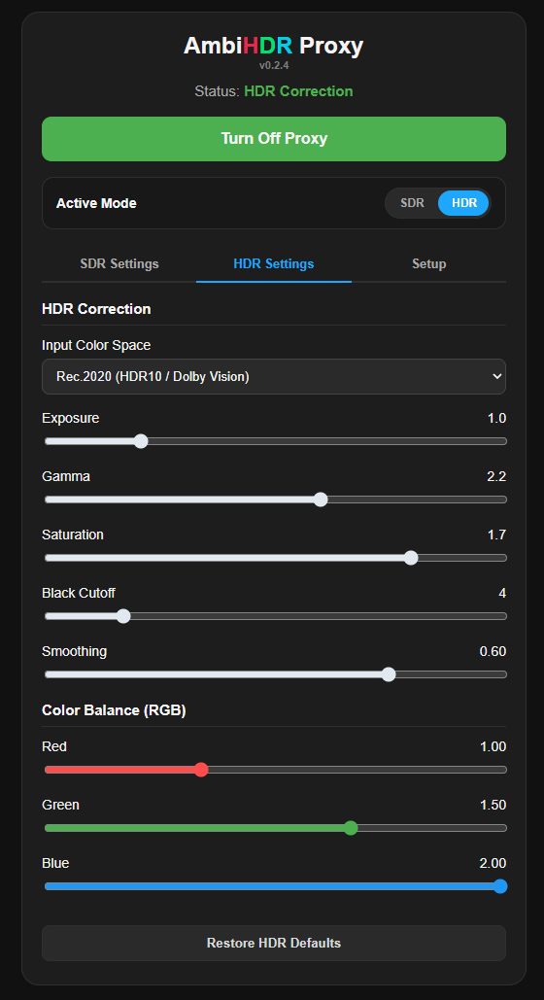

# AmbiHDR Proxy

**AmbiHDR Proxy** is a high-performance UDP proxy written in Python designed to intercept, transform, and real-time correct ambient lighting (**Ambilight**) data streams sent via the **DDP** (Distributed Display Protocol) to **WLED** controllers.

It resolves desaturation, washed-out colors, and overexposure issues that occur when displaying **HDR** content (Rec.2020 / DCI-P3) on RGB LED strips operating in the sRGB/Rec.709 color space.



---

## Key Features

* **Real-Time Tone Mapping & Color Space Conversion**:
  * Matrix transformations from **Rec.2020** (HDR10 / Dolby Vision) and **DCI-P3** to **Rec.709** (sRGB).
  * Dynamic 3D Look-Up Table (**3D LUT** of 64 x 64 x 64) generation running in a background worker thread to prevent main thread blocking.
* **Ultra-Low Latency (~1 ms)**:
  * Vectorized matrix processing using `NumPy`, executing color corrections via byte-level bit-shifting.
* **Non-Blocking UDP Socket Management**:
  * Intelligent buffer handling with frame dropping to prevent latency accumulation or desynchronization caused by network jitter.
* **Interactive Web Control Panel (Flask)**:
  * On-the-fly configuration of independent profiles for **SDR** and **HDR**.
  * Fine-tuning for Exposure, Gamma, Saturation, Black Cutoff, Temporal Smoothing, and Per-Channel RGB Gain.
* **Built-in Performance Metrics**:
  * Live monitoring of Reception FPS (RECV FPS), Processing FPS (PROC FPS), and internal processing latency.

---

## Data Flow Architecture

```text
[ Capture Source ] ---> UDP / DDP (Port 21324) ---> [ AmbiHDR Proxy ] ---> UDP / DDP (Port 4048) ---> [ ESP32 / WLED ]
(ScreenGlow / PC)                                   (LUT Processing)                                  (RGB LED Strip)
```

---

## Hardware Requirements & Compatibility

* **Tested Hardware**: Raspberry Pi 3B+ (1GB RAM) running Raspberry Pi OS (64-bit).
* Due to NumPy vectorization and background worker threading, RAM consumption remains below ~50 MB, making it extremely lightweight for SBCs.

---

## Deployment on Raspberry Pi (Docker)

### 1. Install Docker on Raspberry Pi OS
If Docker is not installed on your Raspberry Pi, run:

```bash
# Download and execute the official Docker installation script
curl -fsSL https://get.docker.com -o get-docker.sh
sudo sh get-docker.sh

# Enable Docker service and allow execution without sudo
sudo systemctl enable --now docker
sudo usermod aG docker $USER
```
*(Note: Log out and log back in for group permissions to take effect)*

### 2. Clone & Setup Container

Clone the repository and ensure `config.json` exists locally prior to volume mounting:

```bash
git clone https://github.com/marbalexbriones/AmbiHDR-Proxy.git
cd AmbiHDR-Proxy

# Create config file if it does not exist to prevent Docker from creating a directory
touch config.json
```

### 3. Build & Run
Execute the following commands to build the image and run the container using host networking mode:

```bash
# Remove existing container instance if present
docker rm -f hdr-proxy 2>/dev/null || true

# Build Docker image
docker build -t hdr-proxy .

# Run container with host network stack
docker run -d \
  --name hdr-proxy \
  --net=host \
  --restart unless-stopped \
  -v $(pwd)/config.json:/app/config.json \
  hdr-proxy
```

---

## Quick Start

1. Open the web dashboard in your browser:
   ```text
   http://<RASPBERRY_PI_IP>:5000
   ```
2. Configure your capture software (e.g., **ScreenGlow**) to send the DDP stream to your Raspberry Pi's IP on port `21324`.
3. Enter your **WLED** controller's target IP and port `4048` under the **Setup** tab in the UI.

---

## Calibration Parameters

| Parameter | Description |
| :--- | :--- |
| **Input Color Space** | Toggles between **Rec.2020** (HDR) and **DCI-P3** (Display P3) matrices. |
| **Exposure** | Adjusts gain prior to tone mapping compression. |
| **Gamma** | Gamma curve correction to compensate for the non-linear perceptual response of LEDs. |
| **Saturation** | Controls color intensity resulting after color space conversion. |
| **Black Cutoff** | Sets the minimum threshold (0–25) below which LEDs turn off entirely (eliminates black-level noise). |
| **Smoothing** | Temporal interpolation (0.00 to 0.80) to reduce rapid flickering between frames. |
| **Color Balance (RGB)** | Individual gain multipliers for LED strip white balance calibration. |

---

## Technical Notes & Limitations

* **Exclusive DDP Protocol Support**: The proxy parses the fixed 10-byte header of the DDP protocol. It does not natively support other protocols like E1.31 (sACN) or TPM2 without modifying the payload extraction logic (`extract_ddp_rgb`).
* **3D LUT Resolution**: The fixed grid size of 64 x 64 x 64 provides an optimal balance between color accuracy and table reconstruction speed (~20–40 ms when tweaking sliders). While regeneration occurs in a background worker thread (`lut_worker`), rapid UI adjustments are queued using client-side debouncing.
* **Host Networking (`--net=host`)**: Mandatory for optimal performance and minimal packet processing overhead over low-latency UDP streams.
